# 概率图模型

## 1. Introduction

&emsp;&emsp;对于这个世界的任何物质，大到整个宇宙小到分子原子，其出现和演化的规律均存在一定的不确定性，而从另一个角度进行观察我们则可通过概率来描述。同样对于对于深度学习，我们可以理解为在给定样本下，我们通过神经网络学习出其内在的深层抽象特诊表示，进而对未知的样本进行估计和推断。其中样本的分布规律我们可以通过概率分布进行刻画，而推断的结果的不确定性我们也可以利用概率来表示。因此概率模型（probabilistic model） 为机器学习打开了一扇新的大门，其将学习任务转变为计算变量的概率分布。然而在实际情况中却是各个变量间存在显示或隐示的相互依赖，若我们直接基于训练数据去求解变量的联合概率分布这无论在时间复杂度还是空间复杂度上均是不可信的或不划算的。那么，我们如何有效（高效）紧凑且简洁的表示和计算它们的联合分布概率或条件概率呢，这里便引入了图的概念。通过充分利用变量间的依赖关系、或条件独立假设，我们可以大大简化参数求解的计算开销（若每个变量可能的取值数目为$k$，变量数目为$n$，而$m$表示单个条件概率分布最大的变量数目且$m<<n$，通过图表示我们可以将联合概率求解的复杂度由$O(k^n)$减少为$O(k^m)$）。

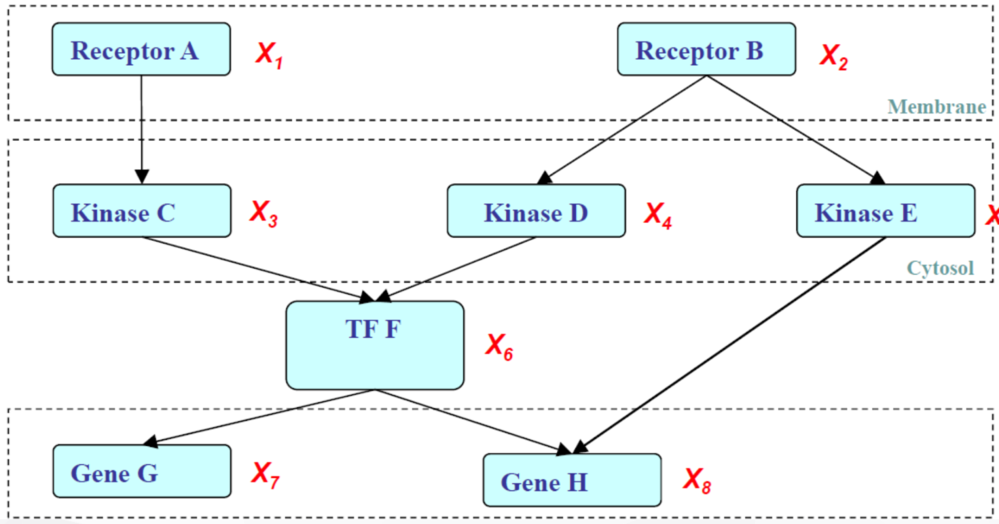
 
图1. 变量间的相互依赖

&emsp;&emsp;图1可以简单的描述类似变量间的复杂关系，从中看出最后对于基因的影响可以追溯到受体，而图结构则能够清晰的进行表示。概率图模型可以简单的理解为“概率+结构”，即利用图模型来结构化各变量的概率并有效、清晰的描述变量间的相互依赖关系，同时还能进行高效的推理，因此在机器学习中概率图模型是一种应用广泛的方法。其中，结点即表示变量，边则表示变量间概率的相关关系。而根据边是否存在指向图模型又可以简单的分为两类：有向无环图和无向图，如下：

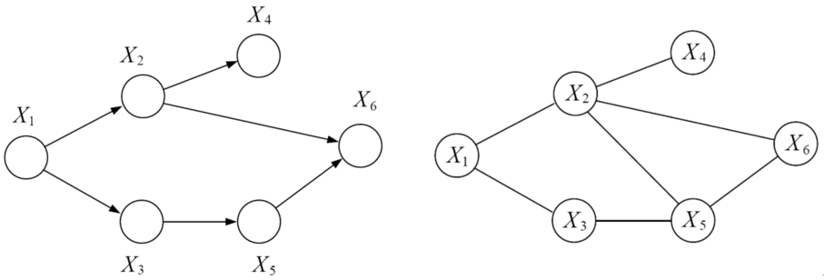
 
图2. 有向图（左）与无向图（右）

&emsp;&emsp;从上图可以看出，有向图（directed graphical model）可以刻画变量间显示存在的因果关系或依赖关系，该模型又称为贝叶斯网络（bayesian network）、信念网（brief network）、因果网（casual network）等。而无向图中变量间显示的因果关系难以获得，因而只能反映变量间的相关性即关联关系，其中马尔科夫随机场（Markov Model）、因子图（factor graph）即为无向图。

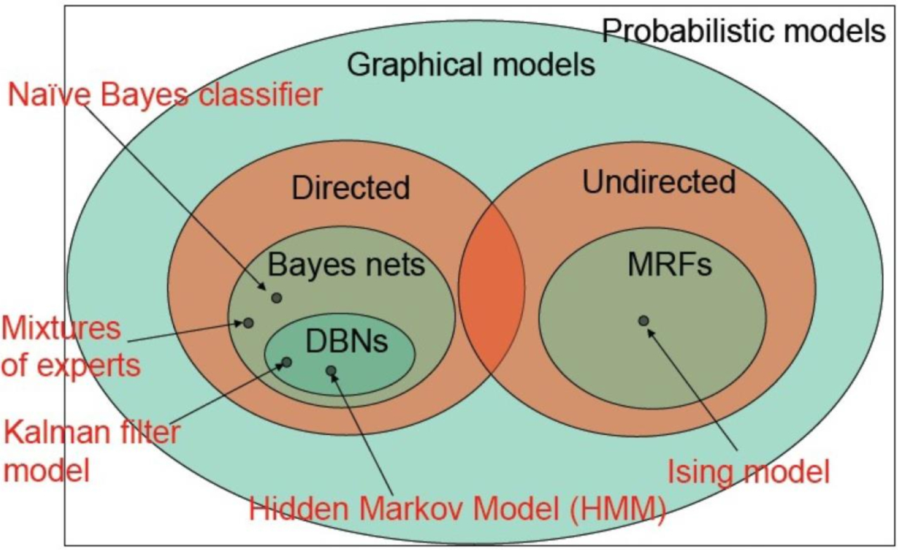
 
图2. 概率图模型家族

&emsp;&emsp;许多经典的浅层模型均属于概率图模型，如朴素贝叶斯、隐马模型、条件随机场、卡尔曼滤波等。现在主流的深度网中也有概率图模型的广泛应用，最常见的便是NLP序列标记问题深度网提取特征后再加上CRF得到概率分布，另外强化学习中部分观察的马尔科夫决策过程（POMDP）也有涉及（有关概率图的经典模型MHH和CRF的介绍可以参看我的这篇笔记[NLP中的序列标注问题（Bi-LSTM+CRF）](https://zhuanlan.zhihu.com/p/50184092)）。

## 2. 有向图模型（贝叶斯网络）

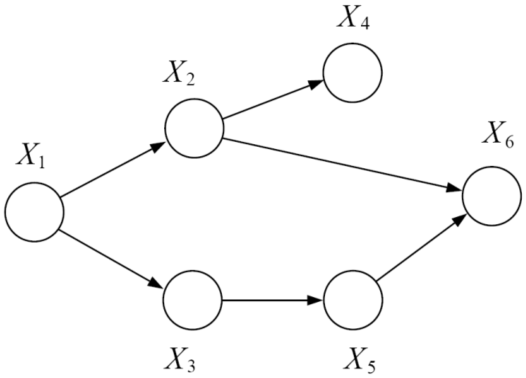
 
图3. 有向无环图

&emsp;&emsp;贝叶斯网络本质上可以表示任何完全联合概率分布，其完整的定义如下：

1. 没个结点对应一个连续或离散的随机变量；
2. 一组有向边连接点对，如果有向边从$X$指向$y$即$x \to y$，则称$x$为$y$的一个父节点；
3. 通过条件分布概率$P(x_i|Parents(x_i))$刻画其父节点$Parents$对$x_i$的影响。
4. 图中不存在任何回路，故又称其为有向无环图（DAG）。 

&emsp;&emsp;网络的拓扑结构可以抽象为结点$V$和边$E$的集合$G=(V,E)$。一个概率图模型对应着一族概率分布，若记每个结点对应的条件概率分布为$p(x_i|x_{\pi i})$，则联合概率分布可以由概率中的乘法公式展开，表示为：

$$
p(x_1,x_2,..,x_n)=P(x_n|x_{n-1}...x_1)P(x_{n-1}...x_1)=P(x_n|x_{n-1}...x_1)P(x_{n-1}|x_{n-2}...x_1)P(x_{n-2}...x_1)\\
=...=\prod^n_{i=1}p(x_i|x_{\pi i})\tag{1}
$$

&emsp;&emsp;而利用图模型，对于图3中联合分布$P(x_1,x_2,x_3,x_4,x_5,x_6)$的计算则为：

$$
P(x_1,x_2,x_3,x_4,x_5,x_6)=P(x_1)P(x_2|x_1)P(x_3|x_1)P(x_4|x_2)P(x_5|x_3)P(x_6|x_2,x_5)\tag{2}
$$

&emsp;&emsp;比较式（1）和式（2）可看出，对于联合分布$P(x_1,x_2,x_3,x_4,x_5,x_6)$，通过图模型建模我们可以极大的简化计算过程，而且其结构也将更加紧致。另外在贝叶斯网络的构造过程中，其计算的复杂通常和局部结构的复杂程度线性相关，即当我们考虑的十分全面时，其结构的复杂度和计算复杂度都将显著增加，而准确率也将提高。因此我们需要充分权衡准确率与复杂度间的trade-off，若只为了些许精度的提高而不断增加结点间微弱的连接，这也是不划算的。

&emsp;&emsp;我们对每一结点按一定顺序$I$进行编号，要求对于任一结点编号$i \in V$，其父节点编号均小于该结点编号，即其父节点均在这个编号顺序中出现在它之前，那么这样构造出的网络将是无环的，且没有冗余的概率值。我们称$I$为拓扑排序，且该网络将满足：给定一个节点$x_i$的父节点$x_{pi i}$， 该节点和其祖先$x_{vi}$，（$x_{vi}$为除去父节点后的祖先结点（编号小于$i$的结点））条件独立这一条件，即断言。证明如下：

&emsp;&emsp;对于图3，结点4有：

$$
P(x_1,x_2,x_3,x_4)=\sum_{x_5}\sum_{x_6}P(x_1,x_2,x_3,x_4,x_5,x_6)=P(x_1)P(x_2|x_1)P(x_3|x_1)P(x_4|x_2)P(x_5|x_3)P(x_6|x_2,x_5)=P(x_1)P(x_2|x_1)P(x_3|x_1)P(x_4|x_2)\sum_{x_5}P(x_5|x_3)\sum_{x_6}P(x_6|x_2,x_5)=P(x_1)P(x_2|x_1)P(x_3|x_1)P(x_4|x_2)\\
P(x_1,x_2,x_3)=\sum_{x_4}P(x_1,x_2,x_3,x_4)=\sum_{x_4}P(x_1)P(x_2|x_1)P(x_3|x_1)P(x_4|x_2)=P(x_1)P(x_2|x_1)P(x_3|x_1)\sum_{x_4}P(x_4|x_2)=P(x_1)P(x_2|x_1)P(x_3|x_1)
$$

&emsp;&emsp;故有：

$$
P(x_4|x_1,x_2,x_3)=\frac{P(x_1,x_2,x_3,x_4)}{P(x_1,x_2,x_3)}=\frac{P(x_1)P(x_2|x_1)P(x_3|x_1)P(x_4|x_2)}{P(x_1)P(x_2|x_1)P(x_3|x_1)}=P(x_4|x_2)\\
P(x_4|x_1,x_2,x_3)=P(x_4|x_2)\tag{3}
$$

&emsp;&emsp;因此，$x_4\bot {x_1,x_3}|x_2$，即给定一个节点的父节点，该节点和其祖先条件独立。上述过程为基于概率的推断，并不是十分直观，我们是否能够直接通过观察图结构而准确判断变量间的条件独立性呢？对此我们可以通过“滚贝叶斯球”解决，首先定义图中三个最基本的结构，如下：

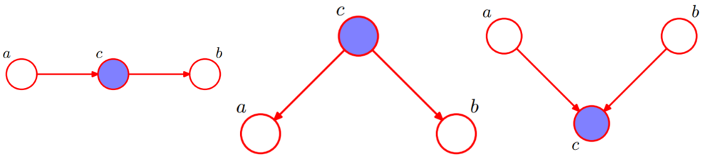
 
图4. 三种基本的有向图模型

&emsp;&emsp;图4（左）即为最简单的马氏链，其$a,b,c$分别代表“过去”，“现在”和“未来”。

$$
P(a,b,c)=P(a)P(c|a)P(c|b)\\
P(b|a,c)=\frac{P(a,b,c)}{P(a,c)}=\frac{P(a)P(c|a)P(b|c)}{P(a)P(c|a)}=P(b|c)\tag{4}
$$

&emsp;&emsp;因此给定$c$，$a,b$条件独立，故我们称$c$将$a,b$“分隔”。这就是马氏链中的挡墙时刻转态只与前一个时刻状态有关而于其他时刻无关的证明。

&emsp;&emsp;图4（中）可以理解为$a,b$拥有共同的起因$c$，即$a,b$只依赖$c$。

$$
P(a,b,c)=P(c)P(a|c)P(b|c)\\
P(a,b|c)=\frac{P(c)P(a|c)P(b|c)}{P(c)}=\frac{P(a|b)}{P(b|c)}\tag{5}
$$

&emsp;&emsp;因此给定$c$，$a,b$条件独立，故我们称$c$将$a,b$“分隔”。

&emsp;&emsp;图4（右）可以理解为$a,b$共同导致$c$，即$a,b$间相互竞争。

$$
P(a,b,c)=P(a)P(b)P(c|a,b)=P(a)P(b)\frac{P(a,b,c)}{P(a,b)}\\
P(a,b)=P(a)P(b)\tag{5}
$$

&emsp;&emsp;即$a,b$条件独立，与$c$无关。

&emsp;&emsp;根据上述三种基本的有向图模型结构通过贝叶斯滚球算法我们即可分析有向图中各个结点的条件独立性。对于图三，若我们给定$x_2,x_3$则根据基本结构1（图4（左））$x_1,x_6$条件独立即$x_1 \bot x_6|{x_2,x_3}$。而给定$x_1,x_6$，$x_2$和$x_3$并非条件独立，即$P(x_2,x_3|x_1,x_6)≠P(x_2|x_1,x_6)P(x_3|x_1,x_6)$。

&emsp;&emsp;有向图模型于由朱迪雅 - 博尔（Judea Pearl）提出，并成功应用于各个邻域，由此而衍生出了一系列的方法，如隐马尔科夫模型、卡尔曼滤波、因子分析、概率主成分分析、独立成分分析、混合高斯、转换成分分析、概率专家系统、Sigmoid信念网络、层次化混合专家等等。最早的专家系统就是基于概率图模型而开发的，在可靠性中故障诊断中其也有广泛应用。也正因为Peral的卓越贡献，其在2011获得了图灵奖。

## 3. 无向图模型（马尔科夫随机场）

&emsp;&emsp;与有向图不同的是无向图个变量间没有显示的因果关系，变量间相互作用，因此我们通过无向的边连接。在有向图中我们可以根据三个基本的结构（或d-划分）来判断两变量间是否条件独立即两个结点路径是否被$阻隔$，那么在无向图中这些基本结构的性质是否仍成立呢？答案明显不是，由于移除了图的方向，对应的父结点与子结点间的方向性也被移除，因此只要图中存在至少一条路径未被“阻隔”则条件独立性均未必成立，或者更精确地说，存在⾄少某些对应于图的概率分布不满⾜条件独⽴性质。此外，我们还将思考一个这样的问题，是否能将无向图转化为有向图？答案当然也不能实现完全等价的转化。若要将无向图转化为有向图则必须以牺牲一部分条件独立性为代价进行道德化操作。我们定义马尔可夫毯：

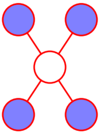
 
图5. 马尔可夫毯

&emsp;&emsp;在⼀个⽆向图中，结点$x_i$的马尔科夫毯由相邻结点的集合组成。对于结点$x_i$其只条件依赖于相邻结点，⽽条件独⽴于任何其他的结点。

&emsp;&emsp;此外在有向图中我们可以依赖每个变量条件概率求解联合概率，而在无向图中由于失去了变量间的因果指向关系，其并不对应一个条件分布，因此通过局部参数表示联合概率将会面对一致性问题。对此我们只能放弃条件概率，牺牲局部概率的表示能力而定义势函数来表示联合分布概率。对此我们根据朴素图理论分割引入团的概念。

&emsp;&emsp;图上的团是一个完全连接的节点子集（个⼦集中的每对结点之间都存在连接），也即局部函数的定义域。为了不失一般性我们引入极大团，即没法再增加额外点的团，即不能被其他团包含的的团（极大团不为任何其他团的子集）。

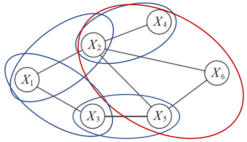
 
图6. 极大团

&emsp;&emsp;上图中椭圆围住的结点即为极大团。此时联合概率分布即可分解为多个团势能函数（因子）的乘积。如下：

$$
P(X)=\frac{1}{Z}\prod_{Q \in C}\phi_{X_Q}(X_Q)\\
Z=\sum_x\prod_{Q \in C}\phi_{X_Q}(X_Q)\tag{6}
$$

&emsp;&emsp;上式中，$X=\{x_1,x_2,...,x_n\}$，则$P(X)$即为联合概率。$C$为所有团$Q$构成的集合，$Z$为则正则化因子或配分函数，通过正则化满足了联合概率的有效性（和为1）。其中势函数的设计要很多技巧和限制。势函数的设计必须使得模型求解高效，同时还因满足$Z$的求和或积分为1，不能在给定的定义域内发散（如当势函数$\phi(x)=x^2$时，$Z=\int x^2dx$发散。又或在定义域未知时，势函数不能设计为$\phi(x)=e^{bx}$的形式，因为$x \in \Bbb {R^n}$时其积分发散）。那么我们能否使用边际i概率$P(x_c)$作为势函数呢？

&emsp;&emsp;考虑如下最为简单的无向图：

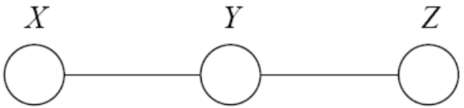
 
图7. 基本无向图结构

&emsp;&emsp;对于该无向图，若我们给定$Y$则$X,Z$条件独立$X \bot Z|Y$，则有$P(x,y,z)=p(y)p(x|y)p(z|y)=p(x,y)p(z|y)$。而根据极大团联合概率分布的定义有$p(x,y,z)=p(x,y)p(y,z)$。故$p(y,z)=p(z|y)=p(z|y)p(y)$，即$p(y)=1\;or\; p(y)=0$，这显然将不符合事实，因此我们不能利用边际概率定义势函数，那么什么样的势函数才能满足要求呢？

&emsp;&emsp;这里以晶体物理中晶包模型为motivation，我们将每个原子看作一个结点，由于模式连续性或电磁力等因素，相邻节点状态耦合，而最可能的一组联合配置，通常对应一个低能量状态以保证稳定性。故我们考虑玻尔兹曼分布，将势函数定义为：

$$
P(X)=\frac{1}{Z}\prod_{Q \in C}\phi_{X_Q}(X_Q)=\frac{1}{Z}\prod_{Q \in C}exp(-H_Q(X_Q))=\frac{1}{Z}exp{\sum_{Q \in C}(-H_Q(X_Q)}=\frac{1}{Z}exp(-H(X))\\
Z=\sum_x\prod_{Q \in C}\phi_{X_Q}(X_Q)=\sum_x exp{-H(X)}\tag{7}
$$

&emsp;&emsp;上式中$H$为物理中的能量函数，其常见的形式如下：

$$
H_Q(X_Q)=\sum_{u,v \in Q,u≠v}\alpha_{uv}x_ux_v+\sum_{v \in Q}\beta_v x_v\tag{8}
$$

&emsp;&emsp;上式中$\alpha_{uv},\beta_v$为参数，第一项考虑每对结点间的关系，而第二项仅考虑单一结点。

&emsp;&emsp;通过极大团的定义同样在无向图中也有“阻隔”的概念即“分离”。若团$A$中的结点必须经过团$C$才能到达团$B$，则我们称团$A,B$被团$C$分离，即$X_A \bot X_B|X_C$，其中$C$为“分离集”（separating set），如下：

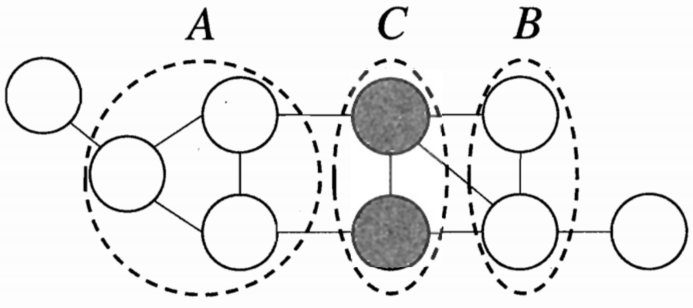
 
图8. 无向图中的分离

&emsp;&emsp;对于马尔可夫随机场有全局马尔可夫性：

- 全局马尔可夫性（global Markov property）:给定两个变量子集的分离集，则这两个变量子集条件独立。

&emsp;&emsp;根据马尔可夫性我们可以推倒出如下两个有用的结论：

- 部马尔科夫性（local Markov property）：如果给定任意一变量的邻居，该变量和其余变量条件独立。
- 成对马尔可夫性（pairwise Markov property）:给定所有其它变量，两个连接变量条件独立。

## 4. 无向图模型与有向图的转化

&emsp;&emsp;有向图和无向图均有明显的优缺点，有向图能够高效的从模型中抽取样本（吉布斯采样），无向图通常对于近似推断过程是十分有效的。因此，我们不能简单的判断两者的优越性，在实际情况中通常需要根据希望描述的概率分布来选择模型。而有些时候我们希望在两个模型间相互切换。

&emsp;&emsp;为了将有向模型图$D$转换为无向模型，我们需要创建一个新图$M$。对于每对变量$x$和$y$，如果存在连接$D$中的$x$和$y$的有向边（任一方向），或者如果$x$和 $y$都是图$D$中另一变量$z$的父节点，则在$M$中添加连接$x$和$y$的无向边。得到的图 $M$即为道德图（moralized graph）。

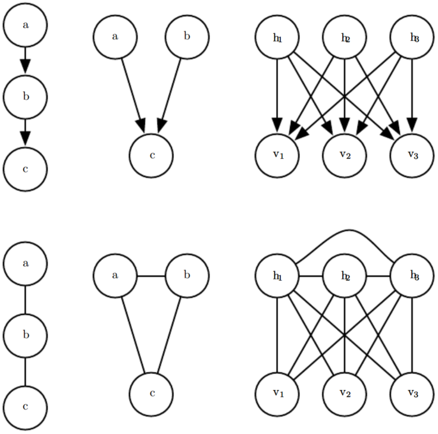
 
图9. 道德化

&emsp;&emsp;上图即为道德化过程，其中（图9中）即为最简单的道德化过程，结点$a,b$均为$c$的父节点，而它们之间没有边连接（无法编码$a \bot b$这个信息），这个结构不道德（immorality，可以理解为$a,b$为结婚便生下$c$，神解释）。对此我们在$a,b$间添加边道德化。一般来说，道德化的过程会给图添加许多边，因此丢失了一些隐含的独立性同时也增加了图的复杂性。

&emsp;&emsp;同样地，如果无向图$M$包含长度大于3的环（loop）（环指的是由无向边连接的变量序列，并且满足序列中的最后一个变量连接回序列中的第一个变量，形成回路），则有向图$D$将不能捕获无向模型$M$所包含的所有条件独立性，除非该环还包含弦 （chord）（弦为环序列中任意两个非连续变量之间的连接）。如果$M$具有长度为4或更大的环，并且这些环没有弦，则我们必须在将它们转换为有向模型之前添加弦通过将弦添加到$M$形成的图被称为弦图（chordal
graph）或者三角形化图（triangulated graph）。 要从弦图构建有向图$D$，我们还需要为边指定方向，为$M$中的边分配方向的一种方法是对随机变量排序，然后将每个边从排序较早的节点指向排序稍后的节点。如下：

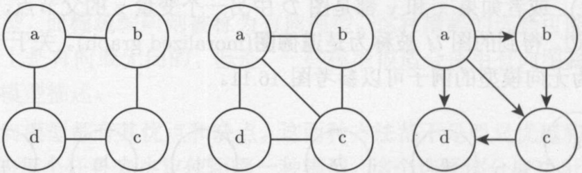
 
图10. 无向图转化为有向图

&emsp;&emsp;如上图所示，我们将一个无向图中有一个长度为4且不带有弦的环。该模型包含了两种不同的独立性，并且不存在一个有向模型可以同时描述这两种性质：$a \bot c|{b,d}$和$b \bot d|{a,c}$。为了将无向图转化为有向图，我们必须保证所有长度大于3的环都有弦来三角形化图。因此可以通过添加一条连接$a$和$c$或者连接$b$和$d$的边实现。此外，我们还须给每条边分配一个方向同时保证不产生任何有向环。对此通过赋予节点一定的顺序，然后将每个边从排序较早的节点指向排序稍后的节点。同理在完成无向图转化为有向图的操作中，添加这些弦会丢弃在$M$中编码的一些独立信息。

## 5. 学习与推断

&emsp;&emsp;通过概率图模型我们得到了唯一的联合概率分布，通过联合概率分布我们一般可以计算变量的边际概率分布（积分或求和消去其他变量）和条件概率分布（概率的乘法公式），其中计算条件概率分布的过程即对应推断任务。在推断任务中我们是假定图结构固定已知，然而有一类问题则需要我们从数据出发而推断图本身，即结构学习（structure learning）。一般图结构学习均采用贪心搜索的策略，即定义⼀个可能结构的空间和用于对每个结构评分的度量，通过评分奖励精度高的结构，同时对结构的复杂度做出惩罚，然后添加或移除少量边进行下一步搜索。同时由于图结构的复杂度随结点数目的增加而呈指数增长，因此我们需要借助启发式的方法。根据贝叶斯学派的观点，基于数据$D$推断合理的图模型$M$，其本质是在求解后验概率估计$P(M|D)$，因此图结构的学习过程也即推断过程。

&emsp;&emsp;对于任何基于概率的推断任务，其实就是在给定某个已观察的事件后，即一组证据变量后（evidence valuables）计算查询变量（query evidence）的后验概率分布。其一般可以分为精确推断（如变量消去、信念传播）和近似推断（如采样、变分推断）的方法。

### 5.1 精确推断

#### 5.1.1 变量消去法

&emsp;&emsp;变量消去法也称为枚举法，即利用概率的乘法公式和求和或积分操作计算目标变量的概率，对于图11有：

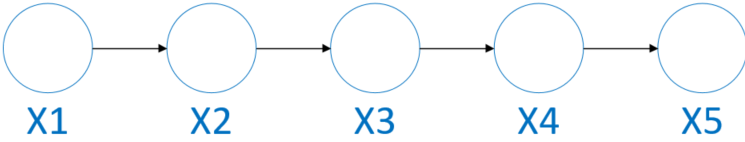
 
图11. 变量消去法

$$
P(x_5)=\sum_{x_1}\sum_{x_2}\sum_{x_3}\sum_{x_4}P(x_1,x_2,x_3,x_4,x_5)=\sum_{x_1}\sum_{x_2}\sum_{x_3}\sum_{x_4}P(x_1)P(x_2|x_1)P(x_3|x_2)P(x_4|x_3)P(x_5|x_4)\tag{9}
$$

&emsp;&emsp;从上式中我们可以看出对于拥有5个变量的网络，当我们对于网络的任何结构信息均未知时，即最坏情况下我们需要对其中4个变量的取值分别求和，而每个变量由与其他变量相互耦合需要5次乘法。因此即使是最简单的$n$个布尔变量（每个变量的取值只能是0和1）的网络，当我们计算各个变量的边际概率时其算法复杂度也为$O(n2^n)$。

&emsp;&emsp;在实际的情况中，我们可以利用网络间变量的相互依赖关系，将其转化为动态规划问题，简化计算。如下：

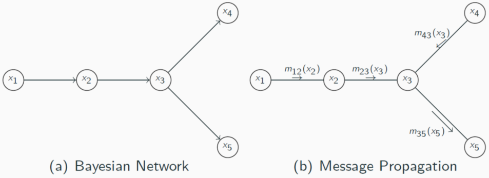
 
图11. 变量消去法消息传递过程

&emsp;&emsp;同样为计算$P(x_5)$我们需消去其他变量，如下：

$$
P(x_5)=\sum_{x_1}\sum_{x_2}\sum_{x_3}\sum_{x_4}P(x_1,x_2,x_3,x_4,x_5)=\sum_{x_1}\sum_{x_2}\sum_{x_3}\sum_{x_4}P(x_1)P(x_2|x_1)P(x_3|x_2)P(x_4|x_3)P(x_5|x_3)\\
=\sum_{x3}P(x_5|x_3)\sum_{x_4}P(x_4|x_3)\sum_{x_2}P(x_3|x_2)\sum_{x_1}P(x_1)P(x_2|x_1)\\
=\sum_{x3}P(x_5|x_3)\sum_{x_4}P(x_4|x_3)\sum_{x_2}P(x_3|x_2)m_{12}(x_2)\\
=\sum_{x3}P(x_5|x_3)m_{23}(x_3)\sum_{x_4}P(x_4|x_3)\\
=\sum_{x3}P(x_5|x_3)m_{23}(x_3)m_{43}(x_3)\\
=m_{35}(x_5)\tag{10}
$$

&emsp;&emsp;上式中，$m_{ij}(x_j)$即为对$x_j$求加和的中间结果。同理，该方法也适用于无向图模型，当我们将上图中两两向量结点看做一个极大团时同样有：

$$
P(x_5)=\sum_{x_1}\sum_{x_2}\sum_{x_3}\sum_{x_4}P(x_1,x_2,x_3,x_4,x_5)=\sum_{x_1}\sum_{x_2}\sum_{x_3}\sum_{x_4}\frac{1}{Z}\phi_{12}(x_1,x_2)\phi_{23}(x_2,x_3)\phi_{34}(x_3,x_4)\phi_{35}(x_3,x_5)\\
=\frac1Z\sum_{x3}\phi_{35}(x_3,x_5)\sum_{x_4}\phi_{34}(x_3,x_4)\sum_{x_2}\phi_{23}(x_2,x_3)\sum_{x_1}\phi_{12}(x_1,x_2)\\
=\frac1Z\sum_{x3}\phi_{35}(x_3,x_5)\sum_{x_4}\phi_{34}(x_3,x_4)\sum_{x_2}\phi_{23}(x_2,x_3)m_{12}(x_2)\\
=\frac1Z\sum_{x3}\phi_{35}(x_3,x_5)\sum_{x_4}\phi_{34}(x_3,x_4)m_{23}(x_3)\\
=\frac1Z\sum_{x3}\phi_{35}(x_3,x_5)m_{23}(x_3)m_{43}(x_3)\\
=\frac1Zm_{35}(x_5)\tag{12}
$$

&emsp;&emsp;通过利用乘法的分配率，可以将多个变量的积和运算转化为仅与部分变量有关的分步交替进行的积和运算，简化计算。然而在变量消去算法中有一个明显不足的缺陷就是会造成大量的冗余计算，即当我们若要计算$x_4$的边际分布概率$P(x_4)$时，我们仍需再次计算$m_{12}(x_2)$和$m_{23}(x_3)$，这是十分不必要的。为克服该问题，我们引入信念传播算法。

#### 5.1.2 信念传播法

&emsp;&emsp;信念传播（Belief Propagation）算法将变量消去算法中的求和操作看做一个消息传递的过程，如下

$$
m_{ij}(x_j)\sum_{x_i}\phi(x_i,x_j)\prod_{k\in n(i)\backslash\ j}m_{ki}(x_i)\tag{13}
$$

&emsp;&emsp;上式中$m_{ij}(x_j)$表示$x_i$传递至$x_j$的消息，$n_i$为$x_i$的邻近结点。故每次消息的传递仅与变量$x_i$及其邻近结点有关，即消息传递的相关计算被限制在图的局部进行。其中结点的边际分布正比于它所接受的消息的乘积：

$$
P(x_i)\varpropto \prod_{k \in n(i)}m_{ki}(x_i)\tag{14}
$$

&emsp;&emsp;信念传播的过程一般需要经过，根到叶子和叶子到根两个过程，通过一次完成的信念传播过程我们即可得到所有结点的边际分布，如下：

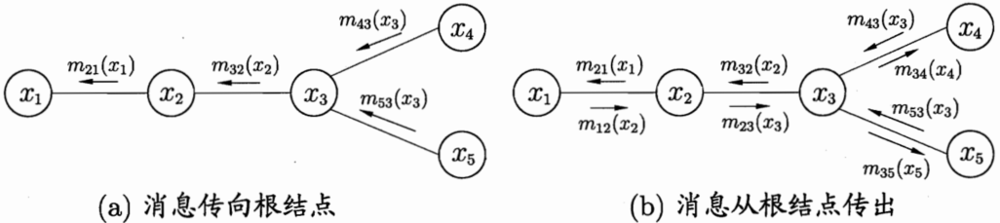
 
图12. 信念传播过程

- 叶子到根：指派一个根节点, 从叶子节点开始传递信息，直到根节点接收到所有邻居节点传来的信息。

$$
m_{43}(x_3)=\sum_{x_4}\phi(x_4,x_3)\\
m_{53}(x_3)=\sum_{x_5}\phi(x_5,x_3)\\
m_{32}(x_2)=\sum_{x_3}\phi(x_3,x_2)m_{43}(x_3)m_{53}(x_3)\\
m_{21}(x_2)=\sum_{x_2}\phi(x_2,x_1)m_{32}x(2)
$$

- 根到叶子: 从根节点开始传播信息,直到所有叶子节点接受到信息。

$$
m_{12}(x_2)=\sum_{x_1}\phi(x_1,x_2)\\
m_{23}(x_3)=\sum_{x_2}\phi(x_2,x_3)m_{12}(x_2)\\
m_{34}(x_4)=\sum_{x_3}\phi(x_3,x_4)m_{23}(x_3)m_{53}(x_3)\\
m_{35}(x_5)=\sum_{x_3}\phi(x_3,x_4)m_{23}(x_3)m_{43}(x_3)
$$

&emsp;&emsp;综上有，个变量的边际分布为：

$$
P(x_1) \varpropto m_{21}(x_1)\\
P(x_2) \varpropto m_{12}(x_2)m_{32}(x_2)\\
P(x_3) \varpropto m_{23}(x_3)m_{43}(x_3)m_{53}(x_3)\\
P(x_4) \varpropto m_{34}(x_4)\\
P(x_5) \varpropto m_{35}(x_5)\\
$$

&emsp;&emsp;变量消去和信念传播算法均为加和-乘积算法。该算法加和乘积的具体顺序和算法的复杂度均由图结构决定，在实际的情况中由于图结构复杂，变量数目庞大精确推断在是不可行的。为此我们需要进行近似推断计算后验概率。

### 5.2 近似推断

&emsp;&emsp;近似推断主要包括两种方法：1.采样法，即马尔科夫链蒙特卡洛采样（Markov chain Monte Carlo，MCMC），其中Gibbs采样为特殊的MCMC；2.变分法。

#### 5.2.1 MCMC采样

&emsp;&emsp;在现实的许多情况下我们需要计算某些变量的和或积分时，由于其数目较多直接计算将不可行，这时我们可以引入蒙特卡洛采样的方法，将求和或积分运算转化为求某一特定分布下的期望，进而通过平均值近似期望得到所求结果。

&emsp;&emsp;此外，如果样本服从i.i.d分布，则在大数定律的前提下，其估计均值必将几乎必然收敛至期望值。这也保证了蒙特卡洛采样的合理性和估计的无偏性。

&emsp;&emsp;实际中，$x$的取值分布$p$十分复杂，故其积分计算通常非常困难。为避免直接计算我们采用MCMC采样。MCMC的核心思想通过随机采样获得独立同分布的样本$x_1,x_2,...,x_n$使得其尽可能的接近$p$分布中的样本，最后得到$p(x)$的无偏估计：

$$
\tilde p(x)=\frac1N\sum_{i=1}^N x_i\tag{16}
$$

&emsp;&emsp;因此现在的问题即转化为如何使得采样样本足够近似的服从$p$分布。这里我们定义$x$在$t$时刻的状态分布概率为$p(x^t)$，状态转移概率$T(x^{t+1}|x^t)$，则有：

$$
p(x^{t+1})=\sum_x p(x^t)T(x^{t+1}|x^t)\tag{17}
$$

&emsp;&emsp;当马尔科夫过程达到平衡时我们认为其样本$x$收敛至$p$分布。故马尔科夫的平稳条件如下所示：

$$
p(x^{t+1})T(x^{t+1}|x^t)=p(x^{t})T(x^{t}|x^{t+1})\tag{18}
$$

&emsp;&emsp;通过合适的状态转移概率$T$，我们最终即可得到所求的采样分布$p$，进而得到变量的概率值。

&emsp;&emsp;在概率图模型中，对于变量概率的估计最常用的即为MCMC采样。我们根据有向图的拓扑顺序采样每一个变量，即使用马氏链进行采样，保证了算法的高效和无重复性。

#### 5.2.2 变分推断

&emsp;&emsp;变分的⽅法起源于18世纪的欧拉、拉格朗日,以及其他关于变分法（calculus of variations）的研究。为理解变分我们首先需要知道什么是泛函（functional），简单来说泛函就是函数的函数，即$J[f(x)]$。其中熵$H[p(x)]=-\int p(x)lnf(x)dx$即为一个典型的泛函。在深度学习中，其实我们很多问题就是在求最优化泛函，即寻求一个最优的映射（表示）$f(x)$使得损失函数，如交叉熵最小。我们对泛函$J[f(x)]$中$f(x)$求导数，即为变分导数$\frac{\delta J}{\delta f(x)}$，表达了输⼊函数产⽣无穷⼩的改变时，泛函的值的变化情况（Feynman et al., 1964）。

&emsp;&emsp;在变分法用于推断近似分布中，我们假设贝叶斯模型中每个参数都有⼀个先验概率分布，其中观测变量记为$X=\{x_1,x_2,...,x_n\}$，隐变量记为$Z=\{z_1,z_2,...z_n\}$。则模型的概率分布密度可表示为：

$$
P(X|\Theta)=\prod_{i=1}^N\sum_zp(x_i,z|\Theta)\tag{19}
$$

&emsp;&emsp;上式两边同时取对数有：

$$
lnP(X|\Theta)=\sum_{i=1}^Nln\{\sum_zp(x_i,z|\Theta)\}\tag{20}
$$

&emsp;&emsp;其中$\Theta$为变量$X,Z$服从分布的参数$\Theta$。可以看出式（20）中既有显示变量又有隐示变量，为最大化似然估计我们无法利用梯度下降法，常见的解法是采用EM算法（有关EM算法的详细介绍可以参考我的这篇笔记[EM算法与GMM（高斯混合聚类）](https://zhuanlan.zhihu.com/p/50686800)）。

&emsp;&emsp;在EM算法的E步中，即给定$\Theta$估计对数似然函数有：

$$
lnP(X)=\frak L(q)+KL(q||p)\\
\frak L(q)=\int q(z)ln\{\frac{p(x,z)}{q(z)}\}dz\\
KL(q||p)=-\int q(z)ln\frac{p(z|x)}{q(z)}dz\tag{21}
$$

&emsp;&emsp;上式中，对于$q(z)$现实中可能由于其十分复杂而难以求解，因此我们可进行变分推断，即假定$q(z)$的分布可分解为：

$$
q(z)=\prod_{i=1}^Mq_i(z_i)\tag{21}
$$

&emsp;&emsp;变分推断中的分解的形式可对应于物理学中的⼀个近似框架，即平均场理论（mean field theory）（Parisi, 1988）。将式（21）代入$\frak{L}$有：

$$
\frak L(q)=\int q(z)ln\{\frac{p(x,z)}{q(z)}\}dz=\int \prod_iq_i\{lnp(x,z)-\sum_ilnq_i\}dz\\
=\int q_j\{\int lnp(x,z)\prod_{i≠j}q_idz_i\}-\int q_jlnq_jdz_j+const\\
=\int q_jln\tilde p(x,z_j)dz_j-\int q_jlnq_jdz_j+const\tag{22}
$$

&emsp;&emsp;故：

$$
ln \tilde p(x,z_j)=\Bbb E_{i≠j}[lnp(x,z)]+const\\
=\Bbb E_{i≠j}[lnp(x,z)]
\Bbb E_{i≠j}[lnp(x,z)]=\int lnq(x,z)\prod_{i≠j}q_idz_i\tag{23}
$$

&emsp;&emsp;其中$\Bbb E_{i≠j}$表⽰关于定义在所有$zi(i≠j)$上的$q$概率分布的期望。观察式（21）可以发现其等价于$-KL(q_j||\tilde p(x,z_j))$。我们要求式（21）的最大值，即求KL的最小值，最大化$q_jln\frac{\tilde p(x,z_j)}{q_j}$。因此当$q_j=\tilde p(x,z_j)$时，$\frak L(q)$最大，因此有隐变量$z_j$其对应的最优分布$q^*_j$应满足：

$$
lnq^*_j(z_j)=\Bbb E_{i≠j}[lnp(x,z)]+const
$$

&emsp;&emsp;故：

$$
q^*_j(z_j)=\frac{exp(\Bbb E_{i≠j}[lnp(x,z)])}{\int exp(\Bbb E_{i≠j}[lnp(x,z)])dz_j}\tag{24}
$$

&emsp;&emsp;根据式（22）可知，当我们恰当的分割独立变量子集$z_j$并选择合适的分布$q_i$，我们即可高效的求解隐变量$z$的分布。

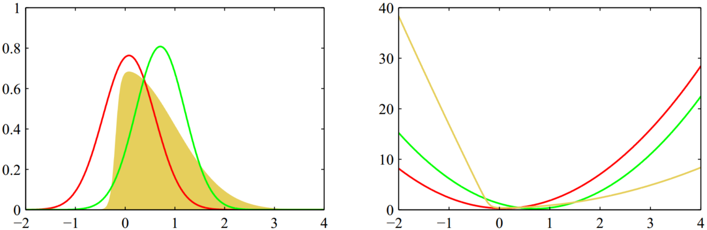
 
图13. 变分近似

&emsp;&emsp;上图中黄色为原始概率分布，红色为拉普拉斯近似，绿色为变分近似。右图为对应曲线的负对数。

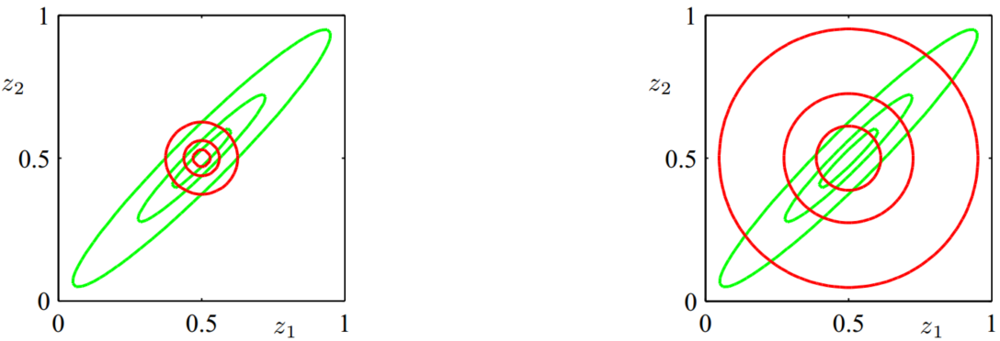
 
图14. KL散度对比1

&emsp;&emsp;上图中绿⾊廓线分别对应两个隐变量$z1$和$z2$上的相关⾼斯分布$p(z)$1、2、3个标准差。同理红色廓线表示两个隐变量$z1$和$z2$上相关⾼斯分近似分布$q(z)$1、2、3个标准差。左图为最小化$KL(q||p)$，右图为最小化$KL(p||q)$。

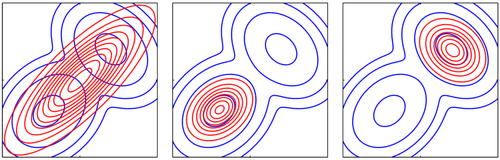
 
图15. KL散度对比2

&emsp;&emsp;图15（左）蓝色廓线表示两个⾼斯分布混合⽽成的双峰概率分布$p(Z)$，红⾊廓线对应于⼀个⾼斯分布$q(Z)$，其最小化$KL(p∥q)$。图15（中）红色廓线对应的⾼斯分布$q(Z)$，其最小化$KL(q∥p)$。图15（右）与图15（中）相同，其为Kullrback-Leibler散度的另⼀个局部最⼩值。

&emsp;&emsp;概率图模型带来的一大好处为：它提供了⼀种简单的方式将概率模型的结构可视化，使得我们能够快速、直观的针对具体任务设计新的模型。通过观察图形，我们可以更深刻地认识模型的性质，此外⾼级模型的推断和学习过程中的复杂计算也可以根据图计算表达。有关概率图模型作为机器学习的重要组成部分，即使实在深度学习红得发紫的今天，其仍有不可撼动的地位，其学习和推理的相关知识仍有其宝贵的价值和启发意义。在其它领域，概率图模型也得到了广泛的应用。

## 6. References

[[1] Goodfellow I. NIPS 2016 Tutorial: Generative Adversarial Networks[J]. 2016.](https://media.nips.cc/Conferences/2016/Slides/6202-Slides.pdf)

[[2] Bishop C M, 박원석. Pattern Recognition and Machine Learning, 2006[M]. Academic Press, 2006.](http://users.isr.ist.utl.pt/~wurmd/Livros/school/Bishop%20-%20Pattern%20Recognition%20And%20Machine%20Learning%20-%20Springer%20%202006.pdf)

[[3] 周志华. 机器学习[M]. 清华大学出版社, 2016.](https://www.amazon.cn/dp/B01ARKEV1G)
