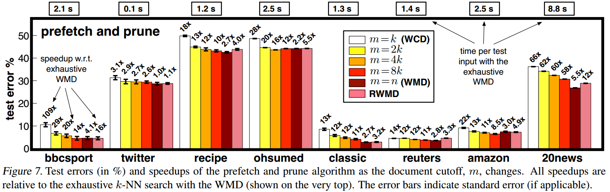

# Sentence Similarity

## Introduction

### Word Similarity

&emsp;&emsp; 在文本分类、信息检索、问答等众多自然语言处理任务中均会涉及相似度的计算，尤其对于文本检索类问题，该需求更为突出。自然语言处理中有关相似度计算任务按照单元大小可以分为词相似度计算，句子相似度计算以及文本相似度计算。其中词相似度计算方法主要包括基于语料库、基于知识库以及基于字符串相似度的方法，如下所示：

 
Fig1. 词相似度计算

- 基于字符串相似度。基于字符串相似度判断词相似度的方法是一种较为简单的方法，其包括有Jaccard相似度、余弦相似度或Levenshtein距离（基于动态规划的方法衡量将一个字符串变化为另一字符串的操作次数）等。对于中文字符串，首先需进行分词处理。由于方法简单且计算量较小，该方法在工程中也得到了广泛的应用。基于字符串的相似度仅是考虑其字符间的相似度而忽略了语义的相似度，而基于知识或语料库的方法则更多的表征词词间的语义相似度；
- 基于知识库相似度。基于知识库的词词相似度主要是利用词语间的关联关系衡量相似性，如基于同义词典或WordNet等；
- 基于语料库计算词词相似度。其主要包括统计模型和深度神经网络，这两种方法本质上均是将词语编码为词向量计算相似性；

### Word Vector

&emsp;&emsp; 对于自然语言处理相关任务，如何将词表示为计算机能够处理的数学符号，其一直是该研究领域的基本问题。相关模型方法如下图所示：

 
Fig2. 词表示

(1) 符号表示。基于规则或统计的方法模型将词看做离散的符号；

(2) 向量表示。目前绝大部分自然语言处理模型均是将词表示为向量使其参与相关运算，其一般可分为离散表示和分布式表示。

- 其中离散表示及忽略词与词间的上下文关系，而将文本片段或语料库视为一个“词袋”。常见的方法包括one-hot向量、词袋模型（统计词出现的频词）以及TF-IDF，即不仅考虑词出现的频词同时还考虑该词是否具有一定的“典型性”。
- 词向量分布式表示主要基于Harris 1954年提出的分布式假设：在相同上下文中出现的词倾向于具有相同的含义，进行建模。其核心思想是认为每个词与其邻居具有较高的相关性且拥有相似的语义特征，因此可以基于其邻居对该词进行向量表示。词向量分布式表示主要包括如话题模型LSI、pLSA、LSA以及ngram等。2001年Benjio等人提出了神经网络语言模型（NNLM）其利用神经网络强大的特征表示能力学习词向量，起一定程度上捕获了词语的语义特征，克服了语义鸿沟的问题。此后，又不断有其它神经网络词向量模型如Skip-gram、C&W、CBOW以及Bert等。如今，词向量以成为自然语言处理中深度学习模型的标准模块。

 
Fig3. 词向量分布式表示

&emsp;&emsp; 基于词向量可以完成同义词检测、基于平均词向量的文本分类、命名实体识别、词性标注等等下游任务。借鉴词向量的基本思想和方法也可以获得句向量，完成句子的相似性计算。

### Sentence Similarity

&emsp;&emsp;句子相似性的衡量方法主要包括基于词、基于句法结构和基于向量的方法。

 
Fig4. Sentence相似度计算

- Word based. 基于词的相似性衡量句子间的相似性主要方法将句子视为字符串将其编码为one-hot向量，然后基于Jaccard、Cosin或Levenshtein计算相似性。或计算两句子间各个词的相似度取平均。或考虑建立词袋模型，基于TF-IDF等计算相似性。上述方法忽略了词语间的上下文关系，同时也忽略了词语间的语义相似性；

- Structure based. 基于句子结构的方法可以利用句子的句法和语义信息，如在计算句子相似度时融入词性信息，或融入词序信息，或融入句法特征等；

- Vector based. 考虑将句子也编码为向量计算相似度。对于句向量的表示方式其又包括基于词向量平均，或基于话题模型学习句子的主题分布，计算相似性。或将句子中各个词向量作为深度神经网络如MaLSTM的输入，以两句子的相似度训练模型，最后将LSTM模型的隐层神经元表示最为句向量。Skip-Tought Vectors的方法与Skip-gram的方法思想类似，其将给定的sentence作为输入预测其邻居sentences，最后获得sentence representation；

## WMD (Word Mover’s Distance)

### WMD建模

&emsp;&emsp;WMD模型是衡量句子相似性的常见方法，其设计动机是来自于运筹学线性规划中的经典问题，即“推土”问题（EMD, earth mover’s distance metric）或产品调拨、运输问题。考虑有$k$个原始仓库，其库存分别为$S_1,...,S_k$。现需要完成货物调配，将仓库中的货物全部分发至$m$地，分发完成后各地的货物数量为$P_1,...P_m$，记从$i$厂库调拨至$j$地的货物数量为$x_{ij}$，同时每单位货物运输成本为$c_{ij}$，现要求设计最优的调度方案，使得成本最低。

&emsp;&emsp;上述问题为典型的线性规划问题，其标准模型如下：

$$
min \; Cost=\sum_{i=1}^{k}\sum_{j=1}^{m} c_{ij}x_{ij}\\
s.t.\quad \sum_{i=1}^{k} x_{ij}=P_j, \qquad j=1,...,m\\
\qquad \sum_{j=1}^{m} x_{ij}=S_i, \qquad i=1,...,k
$$

&emsp;&emsp;对于该问题的求解方法以比较成熟，一般包括单纯形法、Benders分解、DW分解或启发式等。

&emsp;&emsp;基于上述思想，作者定义句子A和B，同时将句子A中个单词视为仓库，将句子B中的个单词视为目的地，因此，考虑将句子A中各个单词的“信息"分配至各个目的地，以完成句子A向句子B的转化，而最小“成本”即可视为句子A、B的相似度，其中“信息”量的大小可由word2vector表示，。如图5所示，衡量“Obama speaks to the media in Illinois”和“The President greets the pressin Chicago.”的相似度，若采用词袋模型其“文本”相似度为0，但是明显这两个句子表达内容相似，因此考虑使用WMD距离衡量将句子1转化为句子2的“成本”。故：

$$
min_{T\geq 0}\sum_{i,j=1}^nT_{ij}c(i,j)\\
s.t. \quad \sum_{j=1}^nT_{ij}=d_i, \qquad i=1,...,n\\
\qquad \sum_{i=1}^nT_{ij}=d_j', \qquad j=1,...,n
$$

&emsp;&emsp;上式中，$c(i,j)$表示由$word_i$转移单位“信息”至$word_j$所需“成本”，作者定义其由词向量间的欧式距离表示，即$c(i,j)=||x_i-x_j||_2$。$d_i$和$d_j'$分别由$word_i$在文档$D$中的词频和$word_j$在文档$D'$中的词频计算。

 

 
Fig5. WMD示意图

### WMD求解

&emsp;&emsp;对于一般WMD求解其时间复杂度为$O(p^3logp)$，其中$p$为文档中的词总数，这对大规模语料库的求解仍有较大代价，对此作者期望降低计算成本，考虑：

$$
\sum_{i,j=1}^nT_{ij}c(i,j)=\sum_{i,j=1}^nT_{ij}||x_i-x_j'||_2=\sum_{i,j=1}^n||T_{ij}(x_i-x_j')||_2\\
\geq ||\sum_{i,j=1}^nT_{ij}(x_i-x_j')||_2=||\sum_{i=1}^n(\sum_{j=1}^nT_{ij})x_i-\sum_{j=1}^n(\sum_{i=1}^nT_{ij})x_j'||_2\\=||\sum_{i=1}^nd_ix_i-\sum_{j=1}^nd_j'x_j'||_2=||Xd-Xd'||_2
$$

($a^2-b^2\geq (a-b)^2$)

&emsp;&emsp;上式中$x_i$即为词向量，$d_i$表示$x_i$在文档$D$中的词频，因此最终该句子间的相似度应大于一常数$||Xd-Xd'||_2$，文中作者将其定义为WCD (Word Centroid Distance)，基于该结果即可过滤掉大部分潜在解。

&emsp;&emsp;此外，作者还探讨放松原始模型约束，牺牲一定的“精度”进一步提高求解速度，如下：

$$
min_{T\geq 0}\sum_{i,j=1}^nT_{ij}c(i,j)\\
s.t. \quad \sum_{j=1}^nT_{ij}=d_i, \qquad i=1,...,n\\
$$

&emsp;&emsp;同时有：

$$
\sum_jT_{ij}c(i,j)\geq \sum_jT_{ij}c(i,j^*)=c(i,j^*)\sum_jT_{ij}=c(i,j^*)d_i\\
j^*=argmin_jc(i,j)
$$

&emsp;&emsp;记$c(i,j^*)d_i=l_2(d,d')$。同理，这里也可以对第一个约束进行松弛处理，同时得到bound$l_1(d,d')$。同时定义$RWMD=max(l_1(d,d'),l_2(d,d'))$。基于RWMD对求解空间进行筛减，将极大提高求解速度。具体做法为：

- Step1. 对所有文档计算其与目标文档间的WCD，并由小到大排序，同时取前k个文档计算其与目标文档的WMD；
- Step2. 基于排序遍历剩余文档，计算剩余文档与目标文档的RWMD，同时将其与第k的文档的WDM进行比较，若RWMD>WMD(k)，则舍弃该剩余文档；否则计算该剩余文档与目标文档之间的WMD，并基于大小关系更新前的k近邻文档；

&emsp;&emsp;同时作者指出由于RWMD approximation十分tight，对于某些数据集其可以过滤掉95%的潜在解。

### Experiments

&emsp;&emsp;作者共选择7个数据集作为实验数据其涉及新闻、生活、购物评论、学术等领域，如下：

 
Fig6. Dataset

&emsp;&emsp;其中$n$为文档数，$BOW$为“词”数目，UNIQUE WORDS (Avg)为每篇文档包含的词数目（去重），$|y|$为分类数。

&emsp;&emsp;同时作者基于KNN算法完成文档的分类任务，其中类别$K$即为上述$|y|$，对于“距离”的定义作者分别比较了8种方法，包括BOW、TF-IDF、LDA、LSI等。其测试误差如下所示:

 
Fig7. KNN-based document classification

&emsp;&emsp;由上图可以看出，总的来说LDA、LSI和WMD的方法误差低于其它方法，且WMD对于任一数据集其误差均最低。

&emsp;&emsp;此外，作者还比较了WMD、RWMD、WCD以及不同“邻居”数目$k$在不同数据集下的求解速度、加速比及和误差大小，如下

 
Fig8. WMD，WCD，WRD及k值对求解误差和速度的影响

&emsp;&emsp;可以明显看到WCD拥有最快的加速比但是其误差也相对最大，但是该误差可以通过扩大邻居数目而逐渐减小。该策略与使用WMD和WRD相比其不仅能获得更大的加速比，同时误差也相差不大。同时WMD相较RWMD其并没有较大的精度提升，速度却要远慢于RWMD。

### Conclusion

&emsp;&emsp;总的来说，WMD并不需要设计复杂的网络模型，同时也并未引入额外的超参数，同时思想、操作简单，可解释性好。另外，对于该方法的求解作者也给出了很好的加速策略和试验结果。同时该方法对于数据集的选择并不敏感，几乎对于任意数据集其精度均能有所提升，该方法在如今深度"炼丹"的时代可以算是一股难得的fresh air。

## WRD 

&emsp;&emsp;WRD(Word Rotator's Distance)本质思想与WMD没有差别，只是在WMD基础上进行了一定的改进，其主要变化包括:

- 使用余弦距离代替欧式距离衡量两词间的相似度；
- 考虑即有模长对语料库词向量进行标准化处理，以间接体系该词向量的重要程度，（词向量重要程度与模长正相关）；

&emsp;&emsp;因此有:

$$
min_{T\geq 0}\sum_{i,j=1}^nT_{ij}(1-\frac{w_iw_j'}{||w_i|| \times ||w_j'||})\\
s.t. \quad \sum_{j=1}^nT_{ij}=\frac{||w_i||}{Z}, \qquad i=1,...,n\\
\qquad \sum_{i=1}^nT_{ij}=\frac{||w_j'||}{Z'}, \qquad j=1,...,n
$$

&emsp;&emsp;其中，$Z=\sum_{i=1}^n||w_i||,Z'=\sum_{j=1}^{n'}||w_j'||$。

## Reference
[[1]胡玥. 第8章 神经网路语言模型&词向量[PPT]. 中科院信息工程研究所第二研究室.]()

[[2] Farouk M. Measuring Sentences Similarity: A Survey[J]. Indian journal of science and technology, 2019, 12(25): 1-11.](https://www.bing.com/academic/profile?id=e6da52babbabfa9b312d3384cfeefba5&encoded=0&v=paper_preview&mkt=zh-cn)

[[3] Yokoi, S., Takahashi, R., Akama, R., Suzuki, J., & Inui, K. (2020). Word Rotator's Distance: Decomposing Vectors Gives Better Representations. ArXiv, abs/2004.15003.](https://arxiv.org/pdf/2004.15003.pdf)
 